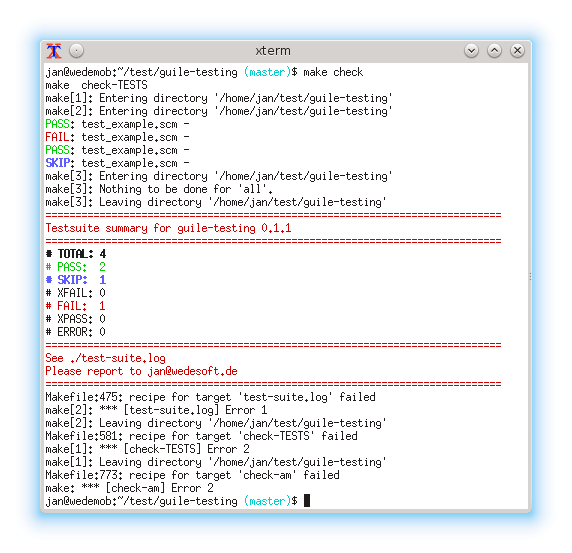

# Testing with Guile and SRFI-64

```
./bootstrap
./configure
make check
```



## External links

* [SRFI-64](http://srfi.schemers.org/srfi-64/srfi-64.html)
* [cuirass build automation server](https://notabug.org/mthl/cuirass)
